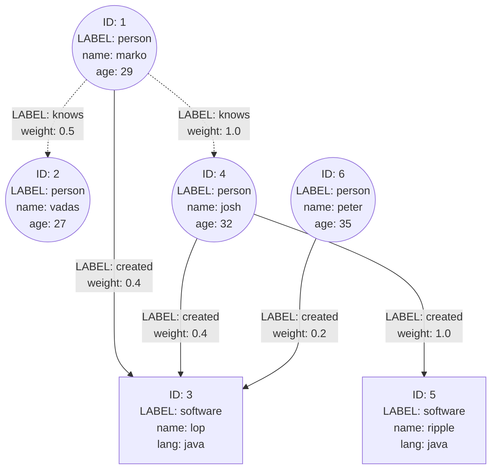

---

title: Creating a Gremlin Playground
date: 2022-04-22T23:16:00
tags:
- databases

---

Apache TinkerPop's Gremlin graph traversal language can be confusing to learn, but thankfully TinkerPop provides some "toy" graphs perfect to learn with.

First, some terminology:

- [Apache TinkerPop](https://tinkerpop.apache.org/) is "an open source Graph Computing Framework"
- [Gremlin](https://tinkerpop.apache.org/gremlin.html) is the "graph traversal language of Apache TinkerPop"

Apache TinkerPop is an umbrella project which has a number of sub-projects:

- The Gremlin traversal language
- The Gremlin CLI console
- A Gremlin-compatible server implementation
- Libraries, client drivers, and more

You can think of Gremlin as the de-facto standard query language for graph databases, the same way SQL is for relational databases. [Amazon Neptune](https://aws.amazon.com/neptune/), [Neo4j](https://neo4j.com/), and [OrientDB](https://orientdb.org/) are some popular graph databases that are Gremlin-compatible.

Gremlin is typically written in [Apache Groovy](https://groovy-lang.org/), "a powerful, optionally typed and dynamic language, with static-typing and static compilation capabilities, for the Java platform", though most libraries will send traversals to a Gremlin server in bytecode. The traversals we'll write below will all be in Groovy.

## The official documentation

The official Apache TinkerPop documentation is fantastic and the tutorials are extremely complete, I'd recommend the [Getting Started](https://tinkerpop.apache.org/docs/3.6.0/tutorials/getting-started/) guide for deeper information on how traversals work.

## Starting a Gremlin session

The easiest way to create a throwaway Gremlin playground is to use [Docker](https://www.docker.com/):

```shell
$ docker run --interactive --tty tinkerpop/gremlin-console:latest gremlin --
Unable to find image 'tinkerpop/gremlin-console:latest' locally
latest: Pulling from tinkerpop/gremlin-console
8663204ce13b: Already exists
8cd18644c6af: Already exists
6587c973fde5: Already exists
e57b6fbb6d24: Already exists
1b9b1eaad732: Pull complete
2e2f30a3e6d4: Pull complete
9f9def6b9e70: Pull complete
e9be91aebc45: Pull complete
5e049e88d4f8: Pull complete
Digest: sha256:9fa9060ebd78c9d4793d866ed677aafbe4fcc70e4c8f59316aefb9cb52f7434e
Status: Downloaded newer image for tinkerpop/gremlin-console:latest

         \,,,/
         (o o)
-----oOOo-(3)-oOOo-----
plugin activated: tinkerpop.server
plugin activated: tinkerpop.utilities
plugin activated: tinkerpop.tinkergraph
gremlin>
```

This will open an interactive Gremlin console that you can exit from at any time with the `:exit` command.  The container won't maintain state between sessions, so you can always exit and open a new session for a fresh set of data.

Let's create a graph, and then create a "traversal source" that uses that graph:

```shell
gremlin> graph = TinkerFactory.createModern()
==>tinkergraph[vertices:6 edges:6]
gremlin> g = traversal().withEmbedded(graph)
==>graphtraversalsource[tinkergraph[vertices:6 edges:6], standard]
```

We can see what vertices exist in the graph along with their label and properties like this:

```shell
gremlin> g.V().valueMap(true)
==>[id:1,label:person,name:[marko],age:[29]]
==>[id:2,label:person,name:[vadas],age:[27]]
==>[id:3,label:software,name:[lop],lang:[java]]
==>[id:4,label:person,name:[josh],age:[32]]
==>[id:5,label:software,name:[ripple],lang:[java]]
==>[id:6,label:person,name:[peter],age:[35]]
```

Here's a visual representation of the built-in "modern" toy graph:



## Some sample traversals

Here are a few graph traversals to get you started learning with the "modern" toy graph.

Finding all people in the graph:

```shell
gremlin> g.V().hasLabel("person").valueMap(true)
==>[id:1,label:person,name:[marko],age:[29]]
==>[id:2,label:person,name:[vadas],age:[27]]
==>[id:4,label:person,name:[josh],age:[32]]
==>[id:6,label:person,name:[peter],age:[35]]
```

Finding all people older than 30:

```shell
gremlin> g.V().hasLabel("person").has("age",P.gt(30)).valueMap(true)
==>[id:4,label:person,name:[josh],age:[32]]
==>[id:6,label:person,name:[peter],age:[35]]
```

Finding what people Marko knows:

```shell
gremlin> g.V(1).out("knows").valueMap(true)
==>[id:2,label:person,name:[vadas],age:[27]]
==>[id:4,label:person,name:[josh],age:[32]]
```

Finding all pieces of software that use Java for their language:

```shell
gremlin> g.V().hasLabel("software").has("lang","java").valueMap(true)
==>[id:3,label:software,name:[lop],lang:[java]]
==>[id:5,label:software,name:[ripple],lang:[java]]
```

Finding who created "lop":

```shell
gremlin> g.V(3).in("created").valueMap(true)
==>[id:1,label:person,name:[marko],age:[29]]
==>[id:4,label:person,name:[josh],age:[32]]
==>[id:6,label:person,name:[peter],age:[35]]
```
