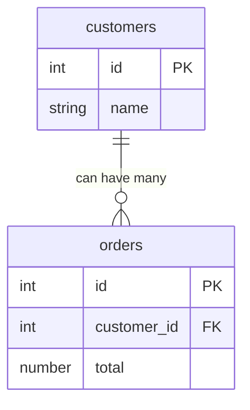
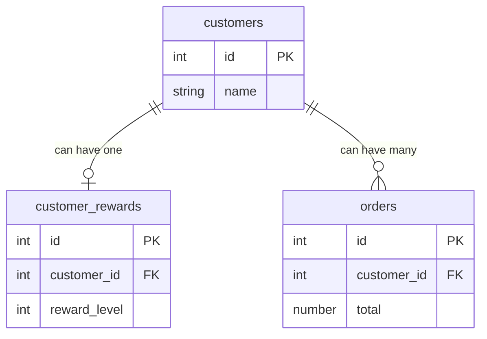

---

title: Inner vs. Outer Joins
date: 2022-04-29T23:18:00
tags:
- databases

---

They can't be used interchangeably, and the differences are important.

Across a few different companies now I've seen developers use outer joins, specifically left outer joins, as the default for how to join tables in a SQL query. I'll outline some dangers with that here.

## The differences

**Inner joins** are used to find the commonality between two or more tables. When an inner join is used, results will only be returned when matches are found between the two tables. This is the default type of join for most databases and is the join that people will want to use the gross majority of the time.

**Outer joins** are used to optionally join two or more tables together. Depending on the direction used ("left" or "right"), one of the tables will have all of its results returned even if there are no matches in the other table. This has very specific use cases and should not be used by default.

## Outer joins aren't commutative

Consider this example where a customer can have some orders associated with them:

<div class="container">
<div class="row row-cols-1 row-cols-md-2">
<div class="col">



</div>
<div class="col">
  <div class="d-flex flex-column justify-content-between h-100">

| customers: id | name   |
|---------------|--------|
| 1             | Isabel |
| 2             | Roy    |
| 3             | Dora   |

| orders: id | customer_id | total |
|------------|-------------|-------|
| 1          | 2 (Roy)     | 51.26 |
| 2          | 3 (Dora)    | 27.20 |
| 3          | 3 (Dora)    | 92.17 |

  </div>
</div>
</div>
</div>

Isabel has no orders, Roy has one order, and Dora has two orders.

Consider this SQL to query all orders, complete with customer info. It makes use of a "left outer join":

```sql
SELECT o.id
     , c.name
     , o.total
FROM orders o
LEFT OUTER JOIN customers c ON o.customer_id = c.id;
```

You will get the 3 expected `orders` rows along with the associated customer's name:

| id  | name | total |
|-----|------|-------|
| 1   | Roy  | 51.26 |
| 2   | Dora | 27.20 |
| 3   | Dora | 92.17 |

But if you swap the order of those two tables you get different results:

```sql
SELECT o.id
     , c.name
     , o.total
FROM customers c
LEFT OUTER JOIN orders o ON o.customer_id = c.id;
```

| id     | name   | total  |
|--------|--------|--------|
| 1      | Roy    | 51.26  |
| 2      | Dora   | 27.20  |
| 3      | Dora   | 92.17  |
| (null) | Isabel | (null) |

_Why is that?_ It's because "outer" joins do not _require_ matches between the two tables. The direction of the outer join ("left" or "right") determines which table will have all of its rows returned, and which table will have rows optionally matched.

In the last query above, the `customers` table is on the "left" and because we used a `LEFT OUTER JOIN` we will have every row from that table returned. The `orders` table is on the "right" so it will be _optionally_ joined to `customers`.

We can construct a `RIGHT OUTER JOIN` that will return the same results, where the table specified on the "right" will have all of its rows returned:

```sql
SELECT o.id
     , c.name
     , o.total
FROM orders o
RIGHT OUTER JOIN customers c ON o.customer_id = c.id;
```

| id     | name   | total  |
|--------|--------|--------|
| 1      | Roy    | 51.26  |
| 2      | Dora   | 27.20  |
| 3      | Dora   | 92.17  |
| (null) | Isabel | (null) |

## Dangers with outer joins

Let's add a third table to our example to represent what reward tier a customer has earned:



| customer_rewards: id | customer_id | reward_level |
|----------------------|-------------|--------------|
| 1                    | 1 (Isabel)  | 1            |
| 2                    | 2 (Roy)     | 1            |
| 3                    | 3 (Dora)    | 2            |

Let's say we want to find the number of orders created by VIP customers (those reward level 2 and above), the total revenue from those orders, and the average revenue per order - all using outer joins:

```sql
SELECT count(*)                AS order_count
     , sum(o.total)            AS total_revenue
     , sum(o.total) / count(*) AS average_revenue
FROM customers c
LEFT OUTER JOIN customer_rewards cr ON cr.customer_id = c.id
LEFT OUTER JOIN orders o ON o.customer_id = c.id
WHERE cr.reward_level >= 2;
```

| order_count | total_revenue | average_revenue |
|-------------|---------------|-----------------|
| 2           | 119.37        | 59.685          |

That result looks right. Dora is the only VIP customer, and she has two orders.

Now let's try that query again for non-VIP customers:

```sql
SELECT count(*)                AS order_count
     , sum(o.total)            AS total_revenue
     , sum(o.total) / count(*) AS average_revenue
FROM customers c
LEFT OUTER JOIN customer_rewards cr ON cr.customer_id = c.id
LEFT OUTER JOIN orders o ON o.customer_id = c.id
WHERE cr.reward_level = 1;
```

| order_count | total_revenue | average_revenue |
|-------------|---------------|-----------------|
| 2           | 51.26         | 25.63           |

_Something is wrong!_ Isabel and Roy are the two non-VIP customers, and they only have one order between the two of them.

It's because `customers` appears on the "left" of `orders`, so all customer rows will be returned regardless of the customer having any orders or not. If we change all joins to be "inner" then we get the expected result:

```sql
SELECT count(*)                AS order_count
     , sum(o.total)            AS total_revenue
     , sum(o.total) / count(*) AS average_revenue
FROM customers c
INNER JOIN customer_rewards cr ON cr.customer_id = c.id
INNER JOIN orders o ON o.customer_id = c.id
WHERE cr.reward_level = 1;
```

| order_count | total_revenue | average_revenue |
|-------------|---------------|-----------------|
| 1           | 51.26         | 51.26           |

## Use cases for outer joins

**When optional/nullable results are acceptable or expected.**

There is no restriction in our database that every customer must have a reward level. We might have a use case for querying every customer in the database, also including their reward level, if it exists.

If we add a fourth customer Lloyd, but we don't give him a reward level, here would be our results:

```sql
SELECT c.id
     , c.name
     , cr.reward_level
FROM customers c
LEFT JOIN customer_rewards cr ON cr.customer_id = c.id;
```

| id  | name   | reward_level |
|-----|--------|--------------|
| 1   | Isabel | 1            |
| 2   | Roy    | 1            |
| 3   | Dora   | 2            |
| 4   | Lloyd  | (null)       |

**When a category/grouping is well-defined but related data is sparse.**

If we add a new table `countries` which contains the five most populous countries in North America:

| countries: id | name          |
|---------------|---------------|
| 1             | United States |
| 2             | Mexico        |
| 3             | Canada        |
| 4             | Guatemala     |
| 5             | Cuba          |

And assign each of our customers a country:

| customers: id | name   | country_id        |
|---------------|--------|-------------------|
| 1             | Isabel | 2 (Mexico)        |
| 2             | Roy    | 1 (United States) |
| 3             | Dora   | 3 (Canada)        |
| 4             | Lloyd  | 1 (United States) |

We can find how many customers we have in every country, even if there are none in the country:

```sql
SELECT co.name
     , count(cu.id)
FROM countries co
LEFT OUTER JOIN customers cu ON cu.country_id = co.id
GROUP BY 1
ORDER BY 2 DESC;
```

| name          | count |
|---------------|-------|
| United States | 2     |
| Canada        | 1     |
| Mexico        | 1     |
| Cuba          | 0     |
| Guatemala     | 0     |

## Join syntax for different databases

In both [PostgreSQL](https://www.postgresql.org/docs/current/queries-table-expressions.html) and [MySQL](https://dev.mysql.com/doc/refman/8.0/en/join.html) the default join type is "inner", and if you specify "left" or "right" it automatically implies "outer". Each of these pairs of queries are semantically the same:

```sql
SELECT * FROM customers c JOIN orders o ON o.customer_id = c.id;
SELECT * FROM customers c INNER JOIN orders o ON o.customer_id = c.id;

SELECT * FROM customers c LEFT JOIN orders o ON o.customer_id = c.id;
SELECT * FROM customers c LEFT OUTER JOIN orders o ON o.customer_id = c.id;

SELECT * FROM orders o RIGHT JOIN customers c ON o.customer_id = c.id;
SELECT * FROM orders o RIGHT OUTER JOIN customers c ON o.customer_id = c.id;
```

## Summary

There are other types of joins such as "cross" joins and "full outer" joins that we didn't cover here, but hopefully this helps clarify when and where you would want to use an outer join over an inner join.
